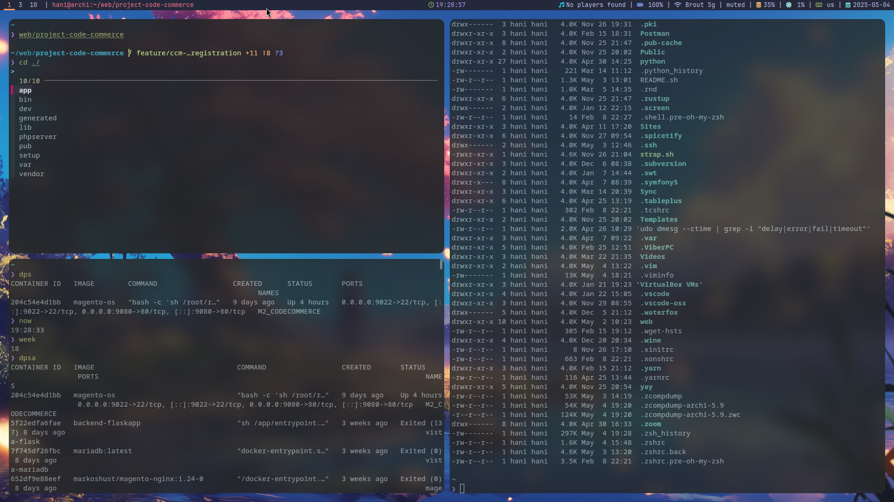

# 🧠 My ZSH Dotfiles

Цей репозиторій містить мій персональний конфігураційний файл для `zsh`, оформлений з темою Powerlevel10k та низкою корисних плагінів для комфортної роботи в терміналі.

## 📁 Структура

```
~/dotfiles-zsh/
├── .zshrc          # Основний конфігураційний файл для zsh
├── aliases.zsh     # Скорочення термінальних команд
└── .p10k.zsh       # Конфігурація для Powerlevel10k
```

## ⚙️ Особливості

- **Powerlevel10k** — красива, функціональна та швидка тема.
- **Oh My Zsh** — менеджер для плагінів та тем.
- **Плагіни**:
  - `git` — автокомпліт та підказки для git-команд.
  - `zsh-autosuggestions` — пропозиції під час введення команд.
  - `zsh-syntax-highlighting` — підсвічування синтаксису.
  - `sudo`, `command-not-found`, `alias-tips`, `colored-man-pages`.

- **Аліаси** для пришвидшення роботи:
  - `ll`, `gs`, `ga`, `gc`, `gp`, `..`, `...`, `please`, `update`

- **Кольоровий `ls`, grep, автодоповнення, історія, PATH, LANG**

## 💫 Зовнішній вигляд


## 🧩 Встановлення

### 1. Клонування репозиторію

```bash
git clone https://github.com/hanashiko/dotfiles-zsh.git ~/dotfiles-zsh
```

### 2. Встановити залежності

- **Zsh**: 
  ```bash
  sudo pacman -S zsh
  ```
- **Oh My Zsh**: 
  ```bash
  sh -c "$(curl -fsSL https://raw.githubusercontent.com/ohmyzsh/ohmyzsh/master/tools/install.sh)"
  ```
- **Powerlevel10k**:
  ```bash
  git clone --depth=1 https://github.com/romkatv/powerlevel10k.git ${ZSH_CUSTOM:-$HOME/.oh-my-zsh/custom}/themes/powerlevel10k
  ```

- **Плагіни**:
  ```bash
  git clone https://github.com/zsh-users/zsh-autosuggestions ${ZSH_CUSTOM:-~/.oh-my-zsh/custom}/plugins/zsh-autosuggestions
  git clone https://github.com/zsh-users/zsh-syntax-highlighting.git ${ZSH_CUSTOM:-~/.oh-my-zsh/custom}/plugins/zsh-syntax-highlighting
  ```

- **command-not-found** (для Arch):
  ```bash
  sudo pacman -S pkgfile
  sudo pkgfile --update
  ```

- **zsh-interactive-cd** (для Arch):
  ```bash
  sudo pacman -S fzf
  ```

### 3. Активувати конфіг

```bash
cp ~/dotfiles-zsh/.zshrc ~/.zshrc
cp ~/dotfiles-zsh/aliases.zsh ~/aliases.zsh
cp ~/dotfiles-zsh/.p10k.zsh ~/.p10k.zsh
chsh -s $(which zsh)
```

Перезапусти термінал.

## 🌐 Мова та локалізація

Конфіг налаштований на `en_US.UTF-8`, що дозволяє уникнути проблем з ASCII/UTF-8 виводом.

## 🔗 Aliases

Зручні скорочення для терміналу, які пришвидшують роботу з файловою системою, git, Docker, Magento, Python, тощо.

---

### 📁 Файлова система та навігація
| Аліас | Команда | Опис | Приклад |
|-------|---------|------|---------|
| `ll` | `ls -lah --color=auto` | Показати список файлів з деталями | `ll` |
| `la` | `ls -A` | Показати всі файли, крім . і .. | `la` |
| `mkdir` | `mkdir -pv` | Створити каталог(и) з виводом | `mkdir new_folder` |
| `..` | `cd ..` | Перейти на рівень вище | `..` |
| `...` | `cd ../..` | Перейти на два рівні вище | `...` |
| `....` | `cd ../../..` | Перейти на три рівні вище | `....` |
| `c` | `clear` | Очистити термінал | `c` |
| `dfh` | `df -hT` | Показати інформацію про диски | `dfh` |
| `duh` | `du -sh * | sort -h` | Показати розмір тек | `duh` |
| `ff` | `find . -name` | Знайти файл за іменем | `ff "*.zsh"` |
| `perm` | `stat -c "%A %n" *` | Показати права доступу до файлів | `perm` |
| `chmodx` | `chmod +x` | Зробити файл виконуваним | `chmodx script.sh` |
| `mounts` | `mount | column -t` | Показати змонтовані файлові системи | `mounts` |
| `lsblkf` | `lsblk -f` | Показати інформацію про блочні пристрої | `lsblkf` |

---

### 🔧 Система і керування процесами
| Аліас | Команда | Опис | Приклад |
|-------|---------|------|---------|
| `sc` | `systemctl` | Утиліта для роботи з systemd | `sc status` |
| `scu` | `systemctl --user` | systemctl для поточного користувача | `scu status` |
| `scs` | `systemctl status` | Переглянути статус юніту | `scs sshd` |
| `sce` | `sudo systemctl enable` | Увімкнути юніт | `sce sshd` |
| `scd` | `sudo systemctl disable` | Вимкнути юніт | `scd sshd` |
| `scr` | `sudo systemctl restart` | Перезапустити юніт | `scr sshd` |
| `scsrt` | `sudo systemctl start` | Запустити юніт | `scsrt sshd` |
| `scstp` | `sudo systemctl stop` | Зупинити юніт | `scstp sshd` |
| `scfail` | `systemctl --failed` | Показати збої | `scfail` |
| `sclist` | `systemctl list-units --type=service` | Список сервісів | `sclist` |
| `scedit` | `sudo systemctl edit --full` | Редагувати конфіг юніту | `scedit sshd` |
| `jctl` | `journalctl -xe` | Журнал systemd | `jctl` |
| `jctlf` | `journalctl -xe -f` | Журнал в режимі реального часу | `jctlf` |
| `kernlog` | `sudo dmesg -T | less` | Показати ядрові повідомлення | `kernlog` |
| `ssda` | `systemd-analyze` | Проаналізувати час завантаження | `ssda` |
| `mem` | `free -h` | Показати використання памʼяті | `mem` |
| `cpu` | `lscpu` | Показати інформацію про CPU | `cpu` |
| `temps` | `sensors` | Показати температуру | `temps` |
| `myprocs` | `ps -u $(whoami)` | Процеси поточного користувача | `myprocs` |
| `pkf` | `pkill -f` | Завершити процес за шаблоном | `pkf python` |
| `k9` | `kill -9` | Завершити процес за PID | `k9 1234` |
| `pgs` | `pgrep -laf` | Знайти процес за іменем | `pgs ssh` |

---

### 🌐 Мережа та IP
| Аліас | Команда | Опис | Приклад |
|-------|---------|------|---------|
| `ipi` | `ip -br a` | Короткий вивід IP-адрес | `ipi` |
| `pingg` | `ping 8.8.8.8` | Ping до Google DNS | `pingg` |
| `myip` | `curl ifconfig.co` | Зовнішня IP-адреса | `myip` |
| `portscan` | `nmap -p- 127.0.0.1` | Сканування портів localhost | `portscan` |

---

### 🧵 Lsof / Порти / Відкриті файли
| Аліас | Команда | Опис | Приклад |
|-------|---------|------|---------|
| `lsofports` | `sudo lsof -i -P -n | grep LISTEN` | Відкриті порти | `lsofports` |
| `lsofport` | `f(){ sudo lsof -i :$1 ; }; f` | Файли для конкретного порту | `lsofport 80` |
| `lsofme` | `lsof -u $USER` | Файли користувача | `lsofme` |
| `lsoff` | `f(){ lsof | grep "$1" ; }; f` | Пошук файлів за шаблоном | `lsoff config` |
| `lsofsock` | `lsof -i` | Всі сокети | `lsofsock` |
| `lsofp` | `f(){ lsof -p $1 ; }; f` | Файли процесу за PID | `lsofp 1234` |

---

### 🧼 Пакетний менеджер (pacman/yay)
| Аліас | Команда | Опис | Приклад |
|-------|---------|------|---------|
| `update` | `sudo pacman -Syyu` | Оновити систему | `update` |
| `install` | `sudo pacman -S` | Встановити пакет | `install neofetch` |
| `pki` | `sudo pacman -S` | Скорочення для встановлення | `pki htop` |
| `remove` | `sudo pacman -Rns` | Видалити пакет | `remove neofetch` |
| `pkr` | `sudo pacman -Rns` | Скорочення для видалення | `pkr htop` |
| `orphan` | `sudo pacman -Rns $(pacman -Qdtq)` | Видалити осиротілі пакети | `orphan` |
| `search` | `pacman -Ss` | Пошук пакету | `search firefox` |
| `pks` | `pacman -Ss` | Скорочення для пошуку | `pks neovim` |
| `ys` | `yay -S` | Встановити пакет через yay | `ys google-chrome` |

---

### 🐳 Docker
| Аліас | Команда | Опис | Приклад |
|-------|---------|------|---------|
| `dps` | `docker ps` | Показати активні контейнери | `dps` |
| `dpsa` | `docker ps -a` | Показати всі контейнери | `dpsa` |
| `dstop` | `docker stop $(docker ps -q)` | Зупинити всі контейнери | `dstop` |
| `drm` | `docker rm $(docker ps -a -q)` | Видалити всі контейнери | `drm` |
| `drmi` | `docker rmi $(docker images -q)` | Видалити всі образи | `drmi` |
| `dimg` | `docker images` | Список образів | `dimg` |
| `dsh` | `docker exec -it` | Увійти в контейнер | `dsh mycontainer bash` |
| `ds` | `docker stop` | Зупинити контейнер | `ds mycontainer` |
| `dk` | `docker start` | Запустити контейнер | `dk mycontainer` |
| `dx` | `docker rm` | Видалити контейнер | `dx mycontainer` |
| `dl` | `docker logs` | Показати логи | `dl mycontainer` |
| `dcu` | `docker compose up -d` | Запустити docker compose | `dcu` |
| `dcb` | `docker compose down` | Зупинити docker compose | `dcb` |

---

### 🔧 Git
| Аліас | Команда | Опис | Приклад |
|-------|---------|------|---------|
| `gs` | `git status` | Статус репозиторію | `gs` |
| `ga` | `git add` | Додати файл до індексу | `ga file.txt` |
| `gaa` | `git add .` | Додати всі зміни | `gaa` |
| `gc` | `git commit` | Закомітити зміни | `gc` |
| `gcm` | `git commit -m` | Коміт з повідомленням | `gcm "Initial commit"` |
| `gp` | `git push` | Відправити зміни | `gp` |
| `gl` | `git pull` | Отримати зміни | `gl` |
| `gco` | `git checkout` | Перемикнутися на гілку | `gco dev` |
| `gcb` | `git checkout -b` | Створити нову гілку | `gcb feature` |
| `gd` | `git diff` | Показати різницю | `gd` |
| `gr` | `git remote` | Керування віддаленими репозиторіями | `gr -v` |
| `gcl` | `git clone` | Клонувати репозиторій | `gcl https://github.com/user/repo.git` |
| `gb` | `git branch` | Список гілок | `gb` |
| `gpl` | `git pull origin $(git branch --show-current)` | Завантажити зміни з origin | `gpl` |
| `gps` | `git push origin $(git branch --show-current)` | Відправити зміни в origin | `gps` |

---

### 🐍 Python / Venv / Pip
| Аліас | Команда | Опис | Приклад |
|-------|---------|------|---------|
| `venv` | `python3 -m venv venv && source venv/bin/activate` | Створити та активувати віртуальне середовище | `venv` |
| `act` | `source venv/bin/activate` | Активувати venv | `act` |
| `pipup` | `pip list --outdated` | Список застарілих пакетів | `pipup` |
| `pipreq` | `pip freeze > requirements.txt` | Згенерувати requirements.txt | `pipreq` |
| `runpy` | `python main.py` | Запустити скрипт | `runpy` |
| `pipi` | `pip install` | Встановити пакет | `pipi flask` |
| `pyfmt` | `black . && isort .` | Форматування Python-коду | `pyfmt` |

---

### 🧰 Інші DevTools
| Аліас | Команда | Опис | Приклад |
|-------|---------|------|---------|
| `cinstall` | `composer install` | Встановити залежності PHP | `cinstall` |
| `reload!` | `source ~/.zshrc` | Перезавантажити конфіг zsh | `reload!` |
| `which` | `command -v` | Показати шлях до команди | `which python` |

---

### 🛠 Magento
| Аліас | Команда | Опис | Приклад |
|-------|---------|------|---------|
| `mcc` | `bin/magento cache:clean` | Очистити кеш Magento | `mcc` |
| `mccf` | `bin/magento cache:clean && bin/magento cache:flush` | Очистити та скинути кеш | `mccf` |
| `mup` | `bin/magento setup:upgrade` | Оновити базу даних Magento | `mup` |
| `mdi` | `bin/magento setup:di:compile` | Компільовка DI | `mdi` |
| `mstatic` | `bin/magento setup:static-content:deploy -f` | Деплой статичних файлів | `mstatic` |
| `mindex` | `bin/magento indexer:reindex` | Переіндексація | `mindex` |
| `murl` | `bin/magento config:set web/unsecure/base_url` | Встановити базовий URL | `murl http://example.com/` |

---

### 🗂 Конфіг файли
| Аліас | Команда | Опис | Приклад |
|-------|---------|------|---------|
| `nvimconf` | `nvim ~/.config/nvim` | Відкрити конфіг Neovim | `nvimconf` |
| `zshconf` | `nvim ~/.zshrc` | Відкрити zsh-конфіг | `zshconf` |
| `bashconf` | `nvim ~/.bashrc` | Відкрити bash-конфіг | `bashconf` |
| `i3conf` | `nvim ~/.config/i3/config` | Конфіг для i3 window manager | `i3conf` |
| `polyconf` | `nvim ~/.config/polybar/config.ini` | Конфіг для Polybar | `polyconf` |

---

### 📦 Архівація / Розархівація
| Аліас | Команда | Опис | Приклад |
|-------|---------|------|---------|
| `extract` | `a(){ ... }; a` | Автоматичне розархівування файлів | `extract file.tar.gz` |
| `gzit` | `f() { tar -czvf "$1.tar.gz" "$1{@:2}"; }; f` | Створити .tar.gz архів | `gz folder` |
| `tarit` | `f() { tar -cvf "$1.tar" "${@:2}"; }; f` | Створити .tar архів | `tarit folder` |

---

### 📅 Дата та час
| Аліас | Команда | Опис | Приклад |
|-------|---------|------|---------|
| `now` | `date +"%T"` | Поточний час | `now` |
| `timestamp` | `date "+%Y-%m-%d %H:%M:%S"` | Поточний timestamp | `timestamp` |
| `today` | `date +"%Y-%m-%d"` | Сьогоднішня дата | `today` |
| `week` | `date +%V` | Номер поточного тижня | `week` |

---

### 🔍 Пошук та історія
| Аліас | Команда | Опис | Приклад |
|-------|---------|------|---------|
| `h` | `history | grep` | Пошук в історії команд | `h ssh` |
| `grepv` | `grep -rni` | Рекурсивний grep з номером рядка | `grepv alias ./` |
| `todo` | `grep -rni TODO .` | Пошук TODO по всьому проєкту | `todo` |

---

### 👤 Користувачі / Групи / Права
| Аліас | Команда | Опис | Приклад |
|-------|---------|------|---------|
| `userslist` | `cur -d: -f1 /etc/passwd` | Список користувачів | `userslist` |
| `groupsme` | `groups $(whoami)` | Групи поточного користувача | `groupsme` |
| `passwdpol` | `chage -l $(whoami)` | Політика паролів | `passwdpol` |
| `sulog` | `lastlog | grep -v "Never logged in"` | Логи входів користувачів | `sulog` |

---

### 😎 Фанові / Забавні
| Аліас | Команда | Опис | Приклад |
|-------|---------|------|---------|
| `please` | `sudo` | Ввічливий sudo | `please pacman -S cowsay` |
| `fuck` | `sudo $(fc -ln -1)` | Повторити останню команду з sudo | `fuck` |
| `shrug` | `echo ¯\\\_(ツ)\_/¯` | Смайлик shrug | `shrug` |
| `wat` | `echo "ಠ_ಠ"` | Смайлик wat | `wat` |
| `flip` | `echo "(╯°□°）╯︵ ┻━┻"` | Перевернутий стіл | `flip` |
| `unflip` | `echo "┬─┬ ノ( ゜-゜ノ)"` | Повернення столу | `unflip` |
| `weather` | `curl wttr.in` | Прогноз погоди | `weather` |

---

## 📜 Ліцензія

MIT License. Використовуйте та адаптуйте під свої потреби.

---

> Зроблено з ❤️ у Unix-терміналі.

